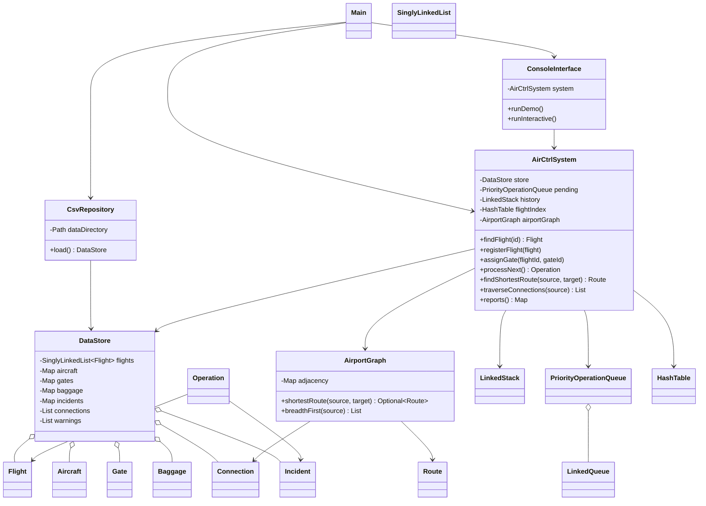

# Diseno completo y UML

## Arquitectura

- `model`: entidades del dominio y resultados de rutas.
- `structure`: estructuras implementadas durante el curso.
- `data`: lectura, validacion y almacenamiento de CSV.
- `graph`: representacion y algoritmos del mapa interno.
- `service`: reglas de negocio y coordinacion de estructuras.
- `ui`: menu de consola y presentacion de resultados.
- `Main.java`: punto de entrada y manejo de errores de carga.
- `tests`: suite automatizada independiente.

## Diagrama de clases



## Flujo de datos

```text
CSV -> CsvRepository -> DataStore -> AirCtrlSystem -> ConsoleInterface
                                  -> AirportGraph
                                  -> Indices y estructuras operativas
```

## Separacion de responsabilidades

La interfaz no lee archivos ni modifica colecciones directamente. El repositorio no muestra informacion al usuario. Las estructuras son genericas y no dependen del dominio. El servicio concentra las validaciones operativas y el grafo concentra sus algoritmos.
